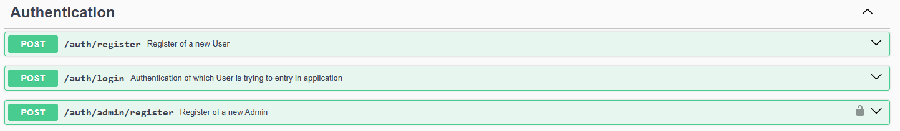

<h1 align="center"> 🏪E-COMMERCE API🏪 </h1>

## 🛒Projeto

Este projeto implementa uma API REST para um sistema de e-commerce, com funcionalidades que incluem gerenciamento de usuários, categorias de produtos, produtos, pedidos e processos de compra.

<b>Authentication</b>

<b>User</b>

<b>Category</b>

<b>Product</b>

<b>Order</b>

<b>Purchase</b>

## 🔧Tecnologias

- **Linguagem**: Java
- **Framework**: Spring Boot (Web, Jpa, Security, Validation, DevTools e Testcontainers)
- **Gerenciamento de Dependências**: Maven
- **Segurança**: Token JWT (auth0)
- **Banco de Dados**: MySQL
- **Migrações de Banco de Dados**: Flyway
- **Testes**: JUnit 5, Mockito e Testcontainers
- **Documentação**: Swagger
- **Containerização**: Docker
- **Deploy**:

## ☁ Utilização

A API pode ser utilizada/testada pelas formas abaixo:

**Remotamente:**
- **Acessando a API no local de hospedagem**:

**Localmente:**
- **Acessando a Documentação da API localmente**: http://localhost:8080/swagger-ui/index.html#/
- **Importando a Collection JSON (Postman ou Insomnia)**: https://github.com/DevDosAnjos/API-REST-ECOMMERCE/blob/main/files/Collection/Ecommerce_collection.json

## 👨‍💻Autor
Nathan dos Anjos Gonçalves

https://www.linkedin.com/in/nathan-dos-anjos-gon%C3%A7alves-58849424a/
